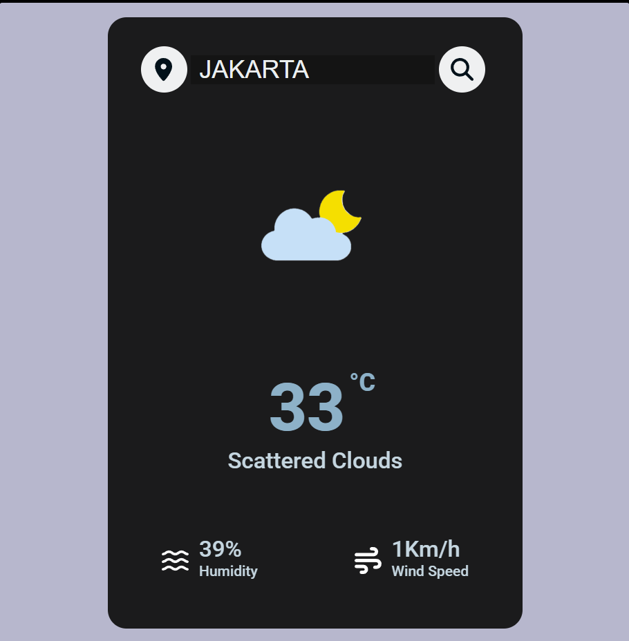

### Credit to `AsmrProg`
Based on tutorial by AsmrProg | Customized by Diqi
https://youtu.be/iILFBGm_I9M?si=7gVLcluiw9a3_K-7

### Note
https://api.openweathermap.org/data/2.5/weather?q=Jakarta&units=metric&appid='YOUR OPENWEATHER API KEY'
get your api key : https://openweathermap.org/api

```javascript
const APIKey = 'Your Api Key';
```

### Screenshot
Here we have project screenshot :

